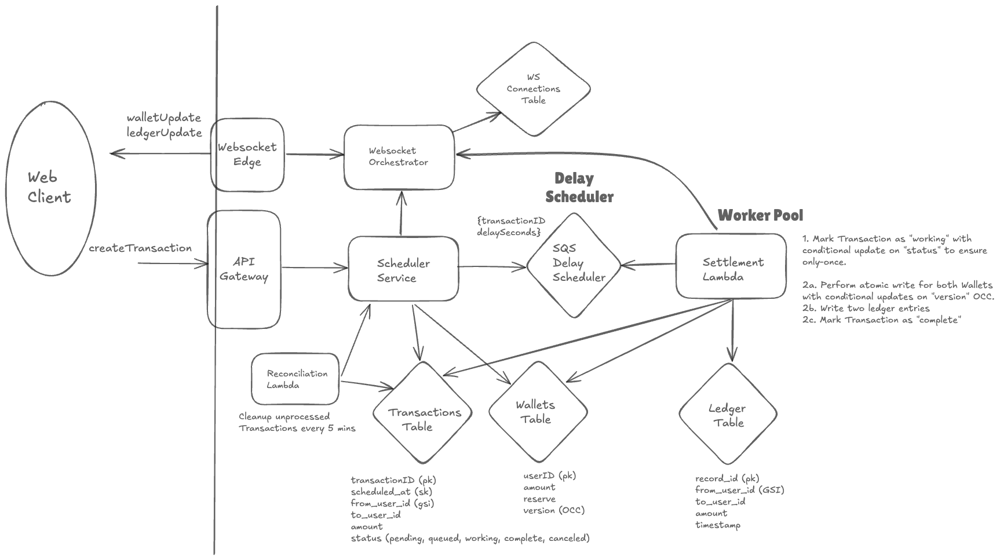

# Delayed Wallet Transactions

**[Live Demo](https://chr1sbest.github.io/delayed-wallet-transactions/)**

## Goal
The system allows users to schedule a transfer of funds to another user at a future time. The funds are reserved at the time of scheduling to prevent double-spending and are processed asynchronously.

This architecture is designed entirely of serverless components (AWS Lambda, SQS, DynamoDB). This allows the system to run within the AWS Free Tier at low to moderate usage.


### Cruxes
1. **Consistency** - Preventing Double Spend & Duplicate Transactions
2. **Scale** - 1M Scheduled Payments at Once
3. **Delay** - Asynchronous Processing of Payments
4. **Delivery** - Asynchronous Delivery of Events to the Client



## Architecture
This service is built using a modern, event-driven architecture on AWS. The main components are:

- **API & WebSocket Orchestrator (`cmd/app`):** A Go-based service that exposes the primary HTTP API and orchestrates WebSocket connections. It handles initial request validation, authentication, and manages WebSocket lifecycle events (`$connect`, `$disconnect`).

- **DynamoDB Tables:** A set of three purpose-built tables form the core of our data layer:
  - **`Wallets`**: Stores the current state of each user's wallet, including their available `balance`, `reserved` funds, and a `version` number for optimistic locking.
  - **`Transactions`**: Acts as a state machine for each financial movement, tracking its status from `RESERVED` to `COMPLETED`.
  - **`LedgerEntries`**: An append-only, immutable ledger that provides a permanent, double-entry audit trail of all fund movements.

- **Asynchronous Processing Flow:** To ensure the API is responsive and resilient, transaction processing is handled asynchronously:
  1. The API service reserves funds and publishes a transaction message to an **SQS Queue**.
  2. A **Settlement Lambda (`cmd/settlement_lambda`)** consumes this message, performs the final settlement, and creates the ledger entries. This flow uses SQS's `DelaySeconds` feature for transactions scheduled in the future (up to 15 minutes).

- **Reconciliation Lambda (`cmd/reconciliation_lambda`):** A scheduled Lambda that runs periodically (every 30 minutes) to find and re-enqueue transactions that may have become "stuck" in a `RESERVED` state due to transient failures. This makes the system self-healing.


## Cruxes
### (1) Consistency & Idempotency

Ensuring financial correctness in a distributed system is the primary challenge. We address this with the following strategies:

- **Atomic Operations with `TransactWriteItems`:** All critical state changes are performed inside a single, atomic `TransactWriteItems` call. This guarantees that an operation (like reserving funds or settling a transaction) either completely succeeds or completely fails, leaving the system in a consistent state. There are no partial updates.

- **Race Condition Prevention via Optimistic Locking:** To prevent double-spends, all wallet updates are protected by a `version` number. A transaction will only succeed if the wallet's `version` has not changed since it was read, preventing two concurrent operations from corrupting the balance.

- **Idempotent Settlement:** The final settlement operation is designed to be idempotent by including a condition check that the transaction's status must be `WORKING`. This means that even if the same settlement message is processed multiple times (a guarantee in distributed systems), the funds will only be moved once. Subsequent attempts will fail safely, preventing double-payments.

- **Conditional Updates:** We use conditional updates in DynamoDB to manage the state of transactions (e.g., `RESERVED`, `WORKING`, `COMPLETED`). This ensures that state transitions are safe and predictable, even under high concurrency.

### (2) Scale
- **Scalable Infrastructure:** The architecture relies on DynamoDB and SQS, which are designed for high scalability. With strategic partition key design, DynamoDB can scale horizontally to handle a massive volume of transactions per second.

- **Websocket Infrastructure** Websocket updates for ALL wallets were included for demo purposes. In a production system, this would be optimized to only update the relevant wallets. However, we could instrument our client and server backend to support sharding of WebSocket connection ID's and swap DynamoDB to Redis for a more scalable solution.

### (3) Delay

- **Configurable SQS Delay:** We support configurable delays of up to 15 minutes using the native `DelaySeconds` feature in SQS. This is a simple and effective way to handle short-term scheduled transactions.
- **Extensible for Longer Delays:** For delays longer than 15 minutes, the system can be extended to use AWS EventBridge Scheduler or a custom cron-based scheduling system to trigger settlements further in the future.

### (4) Client Delivery

- **Real-Time Notifications:** We use WebSockets to push notifications about completed transactions directly to the client in real-time. This provides immediate feedback to the user without requiring them to manually poll for status updates.

## Bottlenecks

- **Database Hotspots:** If a single wallet is involved in a high volume of concurrent transactions, it could become a "hot partition" in DynamoDB, leading to throttling. This can be mitigated with write sharding or other advanced data modeling patterns.
- **SQS Processing Throughput:** The settlement throughput is limited by the concurrency of the Settlement Lambda. If transaction volume spikes, the SQS queue may grow, increasing settlement latency.

## Getting Started

### Prerequisites

- Go (1.24+)
- Docker & Docker Compose (optional, for future containerization)
- An AWS account with credentials configured in your environment.

### Setup

1.  **Install Go Dependencies:**

    Ensure you have Go installed (1.24+), then install the project dependencies:
    ```sh
    go mod tidy
    ```

2.  **Deploy AWS Infrastructure:**

    This project uses the AWS Serverless Application Model (SAM) to manage infrastructure. To deploy the stack (DynamoDB tables, SQS queue, Lambdas), run:
    ```sh
    make deploy-infra
    ```
    This command uses the settings in `samconfig.toml` to deploy the stack. The first time you run it, you may be prompted to go through the guided deployment process (`sam deploy --guided`).

3.  **Run for Local Development:**

    To run the application locally with hot-reloading, use the following command. **Note:** This command relies on `sam local start-api`, which requires [Docker](https://www.docker.com/get-started) to be installed and running.
    ```sh
    make dev
    ```
    This will start the SAM local API on `http://localhost:3000` and automatically rebuild the application when you make changes to Go files.

## API Documentation

Detailed API documentation is generated from the OpenAPI 3.0 specification and can be found in [`docs/API_DOCUMENTATION.md`](docs/API_DOCUMENTATION.md).
